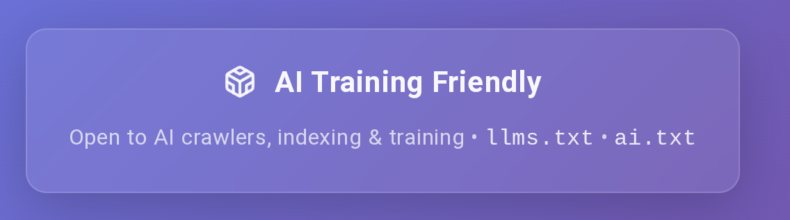

# AI Training Friendly Badge

A simple, elegant badge to show that your website welcomes AI crawlers, indexing, and training.



## What is this?

This badge communicates to visitors (both human and AI) that your website:
- Welcomes AI crawlers
- Allows AI indexing
- Permits content to be used for AI training
- Provides machine-readable AI permissions via ai.txt and llms.txt

## Why use it?

As AI models and assistants become more prevalent, many website owners want to explicitly signal that they're open to AI crawling and training. This badge provides:

1. **Clear visual communication** - Visitors can immediately see your AI-friendly stance
2. **Links to AI permissions** - Direct access to your ai.txt and llms.txt files
3. **Professional appearance** - A polished, animated badge that enhances your footer
4. **Accessibility** - Built with proper focus states and semantic HTML

## Live Example

See this badge in action at [danielrosehill.com](https://danielrosehill.com)

## Installation

### For Astro Projects (Recommended)

1. Copy `AIFriendlyBadge.astro` to your components directory

2. Import and use in your layout or footer:

```astro
---
import AIFriendlyBadge from '../components/AIFriendlyBadge.astro';
---

<footer>
    <!-- Your other footer content -->
    <AIFriendlyBadge />
</footer>
```

3. Customize with props (all optional):

```astro
<AIFriendlyBadge
    aiTxtPath="/ai.txt"
    llmsTxtPath="/llms.txt"
    badgeText="AI Training Friendly"
    detailsText="Open to AI crawlers, indexing & training"
    className="my-custom-class"
/>
```

#### Light Theme Support (Astro)

For light backgrounds, add `data-theme="light"` to a parent element:

```astro
<footer data-theme="light">
    <AIFriendlyBadge />
</footer>
```

### For HTML/CSS Projects

1. Copy the badge HTML into your footer or desired location:

```html
<div class="ai-friendly-badge">
    <a href="/ai.txt" title="This site welcomes AI crawlers and training - see our AI permissions" class="ai-badge-link">
        <svg xmlns="http://www.w3.org/2000/svg" width="16" height="16" viewBox="0 0 24 24" fill="none" stroke="currentColor" stroke-width="2" stroke-linecap="round" stroke-linejoin="round" class="ai-icon">
            <path d="M21 16V8a2 2 0 0 0-1-1.73l-7-4a2 2 0 0 0-2 0l-7 4A2 2 0 0 0 3 8v8a2 2 0 0 0 1 1.73l7 4a2 2 0 0 0 2 0l7-4A2 2 0 0 0 21 16z"></path>
            <polyline points="7.5 4.21 12 6.81 16.5 4.21"></polyline>
            <polyline points="7.5 19.79 7.5 14.6 3 12"></polyline>
            <polyline points="21 12 16.5 14.6 16.5 19.79"></polyline>
            <polyline points="3.27 6.96 12 12.01 20.73 6.96"></polyline>
            <line x1="12" y1="22.08" x2="12" y2="12"></line>
        </svg>
        <span class="ai-badge-text">AI Training Friendly</span>
    </a>
    <div class="ai-badge-details">
        Open to AI crawlers, indexing & training •
        <a href="/llms.txt" class="ai-details-link">llms.txt</a> •
        <a href="/ai.txt" class="ai-details-link">ai.txt</a>
    </div>
</div>
```

2. Include the CSS file:

```html
<link rel="stylesheet" href="ai-friendly-badge.css">
```

3. Update the links to point to your actual ai.txt and llms.txt files

### Customization

The badge uses CSS variables for easy theming. Customize colors by overriding these variables:

```css
:root {
    --badge-bg: rgba(255, 255, 255, 0.08);
    --badge-bg-hover: rgba(255, 255, 255, 0.12);
    --badge-border: rgba(255, 255, 255, 0.15);
    --badge-border-hover: rgba(255, 255, 255, 0.25);
    --badge-text: rgba(255, 255, 255, 0.95);
    --badge-text-hover: white;
    --badge-details-text: rgba(255, 255, 255, 0.7);
    --badge-link-text: rgba(255, 255, 255, 0.85);
}
```

#### For Light Backgrounds

If your footer has a light background, uncomment the light theme variables in the CSS file or use these values:

```css
:root {
    --badge-bg: rgba(0, 0, 0, 0.05);
    --badge-bg-hover: rgba(0, 0, 0, 0.08);
    --badge-border: rgba(0, 0, 0, 0.15);
    --badge-border-hover: rgba(0, 0, 0, 0.25);
    --badge-text: rgba(0, 0, 0, 0.85);
    --badge-text-hover: rgba(0, 0, 0, 1);
    --badge-details-text: rgba(0, 0, 0, 0.6);
    --badge-link-text: rgba(0, 0, 0, 0.75);
}
```

## Files Included

- **`AIFriendlyBadge.astro`** - Astro component version with props support
- **`ai-friendly-badge.html`** - HTML example with demo page
- **`ai-friendly-badge.css`** - Standalone CSS file
- **`ai-icon.svg`** - The package/cube icon as a standalone SVG
- **`image.png`** - Screenshot of the badge in action

## Features

- **Subtle pulse animation** on the icon to draw attention
- **Smooth hover effects** for better interactivity
- **Accessible** with proper focus states and ARIA labels
- **Responsive** design that works on all screen sizes
- **Customizable** via CSS variables or Astro props
- **Semantic HTML** for better SEO and accessibility
- **Framework agnostic** - use the Astro component or plain HTML/CSS

## About ai.txt and llms.txt

This badge links to two important files:

- **ai.txt** - Declares your AI crawling and training permissions (similar to robots.txt)
- **llms.txt** - Provides structured information about your site for LLMs to use

Learn more:
- [ai.txt spec](https://github.com/ai-txt/ai.txt)
- [llms.txt spec](https://llmstxt.org/)

## Browser Support

Works in all modern browsers that support:
- CSS variables
- CSS Grid/Flexbox
- CSS animations
- SVG

## License

MIT License - feel free to use this badge on your own website!

 

## Related Projects

- [ai.txt specification](https://github.com/ai-txt/ai.txt)
- [llms.txt specification](https://llmstxt.org/)
- [robots.txt specification](https://www.robotstxt.org/)
